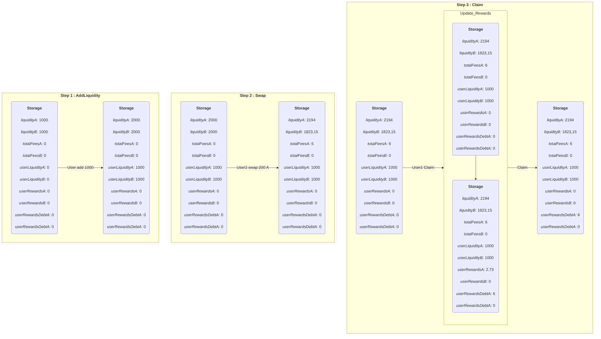
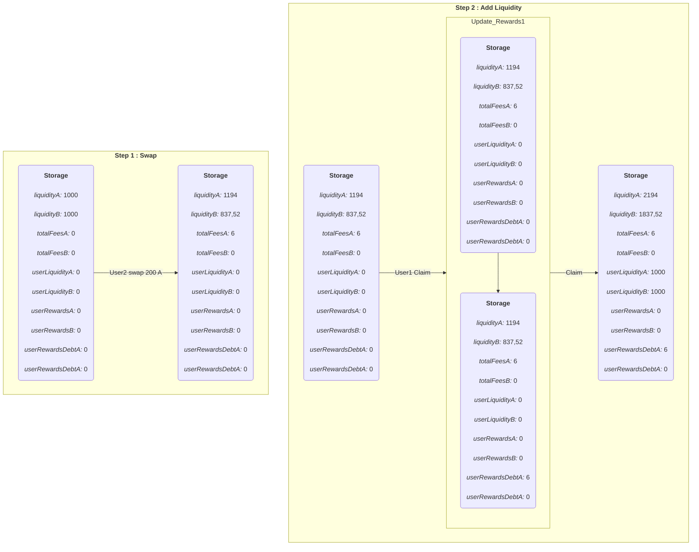

```mermaid
%%{init: {"flowchart": {"htmlLabels": false}} }%%
flowchart TD
subgraph "`**Step 3 : Claim**`"
    subgraph Update_Rewards
    e("`**Storage**<br/>
  *liquidityA:* 2194<br/>
  *liquidityB:* 1823,15<br/>
  *totalFeesA:* 6<br/>
  *totalFeesB:* 0<br/>
  *userLiquidityA:* 1000<br/>
  *userLiquidityB:* 1000<br/>
  *userRewardsA:* 0<br/>
  *userRewardsB:* 0<br/>
  *userRewardsDebtA:* 0<br/>
  *userRewardsDebtA:* 0<br/>
  `") --> f("`**Storage**<br/>
  *liquidityA:* 2194<br/>
  *liquidityB:* 1823,15<br/>
  *totalFeesA:* 6<br/>
  *totalFeesB:* 0<br/>
  *userLiquidityA:* 1000<br/>
  *userLiquidityB:* 1000<br/>
  *userRewardsA:* 2,73<br/>
  *userRewardsB:* 0<br/>
  *userRewardsDebtA:* 6<br/>
  *userRewardsDebtA:* 0<br/>
  `")
    end

  g("`**Storage**<br/>
  *liquidityA:* 2194<br/>
  *liquidityB:* 1823,15<br/>
  *totalFeesA:* 6<br/>
  *totalFeesB:* 0<br/>
  *userLiquidityA:* 1000<br/>
  *userLiquidityB:* 1000<br/>
  *userRewardsA:* 0<br/>
  *userRewardsB:* 0<br/>
  *userRewardsDebtA:* 0<br/>
  *userRewardsDebtA:* 0<br/>
  `") -- "User1 Claim" --> Update_Rewards -- "Claim" --> h("`**Storage**<br/>
  *liquidityA:* 2194<br/>
  *liquidityB:* 1823,15<br/>
  *totalFeesA:* 6<br/>
  *totalFeesB:* 0<br/>
  *userLiquidityA:* 1000<br/>
  *userLiquidityB:* 1000<br/>
  *userRewardsA:* 0<br/>
  *userRewardsB:* 0<br/>
  *userRewardsDebtA:* 6<br/>
  *userRewardsDebtA:* 0<br/>
  `")
end
subgraph "`**Step 2 : Swap**`"
  c("`**Storage**<br/>
  *liquidityA:* 2000<br/>
  *liquidityB:* 2000<br/>
  *totalFeesA:* 0<br/>
  *totalFeesB:* 0<br/>
  *userLiquidityA:* 1000<br/>
  *userLiquidityB:* 1000<br/>
  *userRewardsA:* 0<br/>
  *userRewardsB:* 0<br/>
  *userRewardsDebtA:* 0<br/>
  *userRewardsDebtA:* 0<br/>
  `") -- "User2 swap 200 A" --> d("`**Storage**<br/>
  *liquidityA:* 2194<br/>
  *liquidityB:* 1823,15<br/>
  *totalFeesA:* 6<br/>
  *totalFeesB:* 0<br/>
  *userLiquidityA:* 1000<br/>
  *userLiquidityB:* 1000<br/>
  *userRewardsA:* 0<br/>
  *userRewardsB:* 0<br/>
  *userRewardsDebtA:* 0<br/>
  *userRewardsDebtA:* 0<br/>
  `")
end
subgraph "`**Step 1 : AddLiquidity**`"
  a("`**Storage**<br/>
  *liquidityA:* 1000<br/>
  *liquidityB:* 1000<br/>
  *totalFeesA:* 0<br/>
  *totalFeesB:* 0<br/>
  *userLiquidityA:* 0<br/>
  *userLiquidityB:* 0<br/>
  *userRewardsA:* 0<br/>
  *userRewardsB:* 0<br/>
  *userRewardsDebtA:* 0<br/>
  *userRewardsDebtA:* 0<br/>
  `") -- "User add 1000" --> b("`**Storage**<br/>
  *liquidityA:* 2000<br/>
  *liquidityB:* 2000<br/>
  *totalFeesA:* 0<br/>
  *totalFeesB:* 0<br/>
  *userLiquidityA:* 1000<br/>
  *userLiquidityB:* 1000<br/>
  *userRewardsA:* 0<br/>
  *userRewardsB:* 0<br/>
  *userRewardsDebtA:* 0<br/>
  *userRewardsDebtA:* 0<br/>
  `")
end
```

```mermaid
%%{init: {"flowchart": {"htmlLabels": false}} }%%
flowchart TD
subgraph "`**Step 2 : Add Liquidity**`"
    subgraph Update_Rewards1
    c("`**Storage**<br/>
  *liquidityA:* 1194<br/>
  *liquidityB:* 837,52<br/>
  *totalFeesA:* 6<br/>
  *totalFeesB:* 0<br/>
  *userLiquidityA:* 0<br/>
  *userLiquidityB:* 0<br/>
  *userRewardsA:* 0<br/>
  *userRewardsB:* 0<br/>
  *userRewardsDebtA:* 0<br/>
  *userRewardsDebtA:* 0<br/>
  `") --> d("`**Storage**<br/>
  *liquidityA:* 1194<br/>
  *liquidityB:* 837,52<br/>
  *totalFeesA:* 6<br/>
  *totalFeesB:* 0<br/>
  *userLiquidityA:* 0<br/>
  *userLiquidityB:* 0<br/>
  *userRewardsA:* 0<br/>
  *userRewardsB:* 0<br/>
  *userRewardsDebtA:* 6<br/>
  *userRewardsDebtA:* 0<br/>
  `")
    end

  e("`**Storage**<br/>
  *liquidityA:* 1194<br/>
  *liquidityB:* 837,52<br/>
  *totalFeesA:* 6<br/>
  *totalFeesB:* 0<br/>
  *userLiquidityA:* 0<br/>
  *userLiquidityB:* 0<br/>
  *userRewardsA:* 0<br/>
  *userRewardsB:* 0<br/>
  *userRewardsDebtA:* 0<br/>
  *userRewardsDebtA:* 0<br/>
  `") -- "User1 Claim" --> Update_Rewards1 -- "Claim" --> f("`**Storage**<br/>
  *liquidityA:* 2194<br/>
  *liquidityB:* 1837,52<br/>
  *totalFeesA:* 6<br/>
  *totalFeesB:* 0<br/>
  *userLiquidityA:* 1000<br/>
  *userLiquidityB:* 1000<br/>
  *userRewardsA:* 0<br/>
  *userRewardsB:* 0<br/>
  *userRewardsDebtA:* 6<br/>
  *userRewardsDebtA:* 0<br/>
  `")
end
subgraph "`**Step 1 : Swap**`"
  a("`**Storage**<br/>
  *liquidityA:* 1000<br/>
  *liquidityB:* 1000<br/>
  *totalFeesA:* 0<br/>
  *totalFeesB:* 0<br/>
  *userLiquidityA:* 0<br/>
  *userLiquidityB:* 0<br/>
  *userRewardsA:* 0<br/>
  *userRewardsB:* 0<br/>
  *userRewardsDebtA:* 0<br/>
  *userRewardsDebtA:* 0<br/>
  `") -- "User2 swap 200 A" --> b("`**Storage**<br/>
  *liquidityA:* 1194<br/>
  *liquidityB:* 837,52<br/>
  *totalFeesA:* 6<br/>
  *totalFeesB:* 0<br/>
  *userLiquidityA:* 0<br/>
  *userLiquidityB:* 0<br/>
  *userRewardsA:* 0<br/>
  *userRewardsB:* 0<br/>
  *userRewardsDebtA:* 0<br/>
  *userRewardsDebtA:* 0<br/>
  `")
end
```